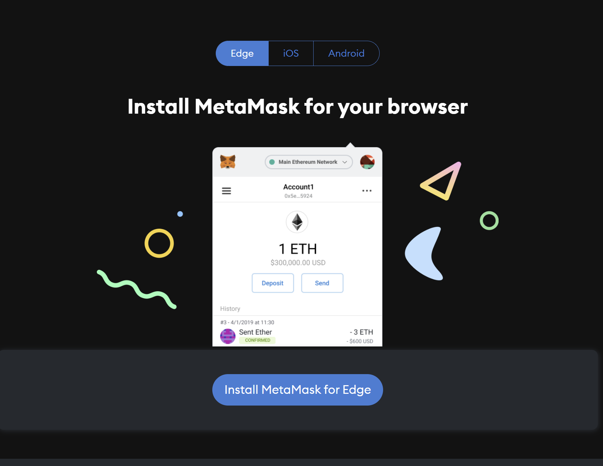
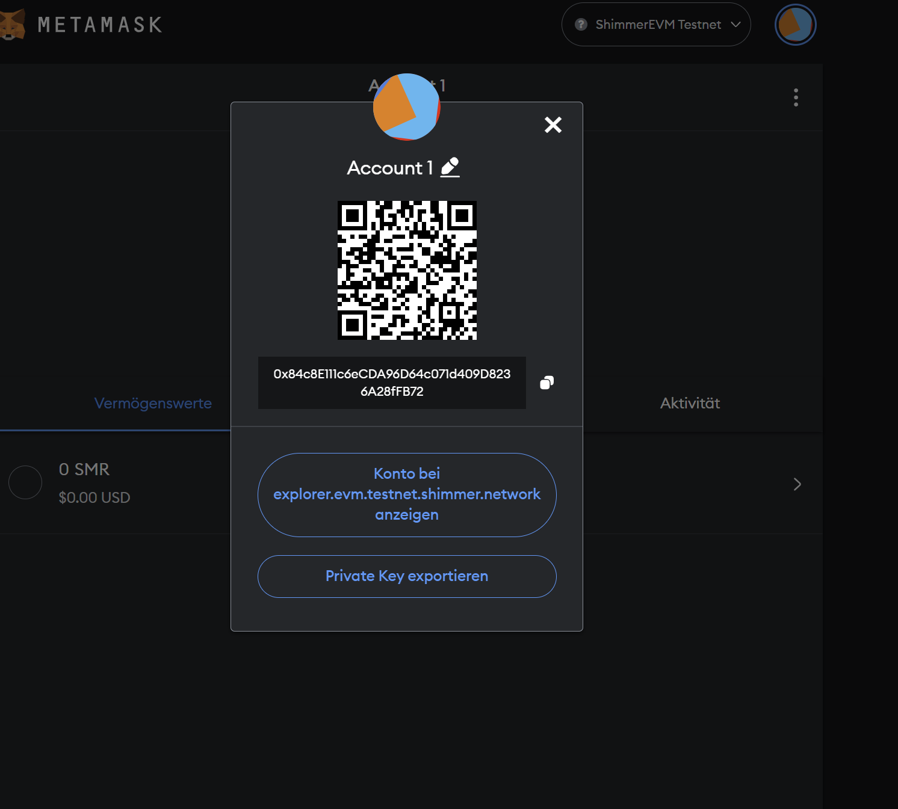
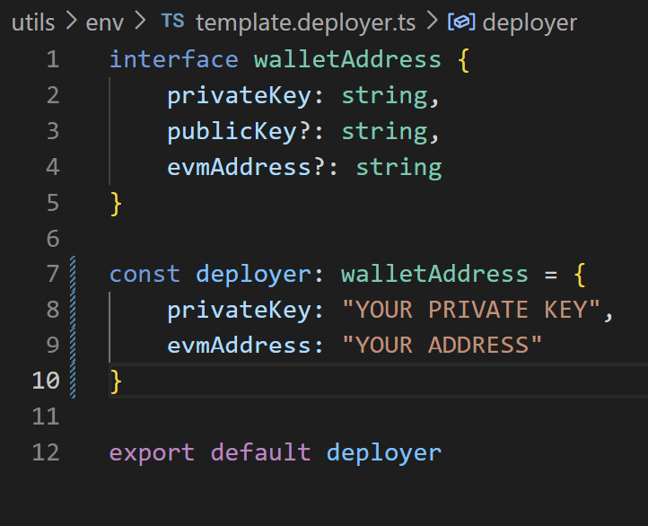
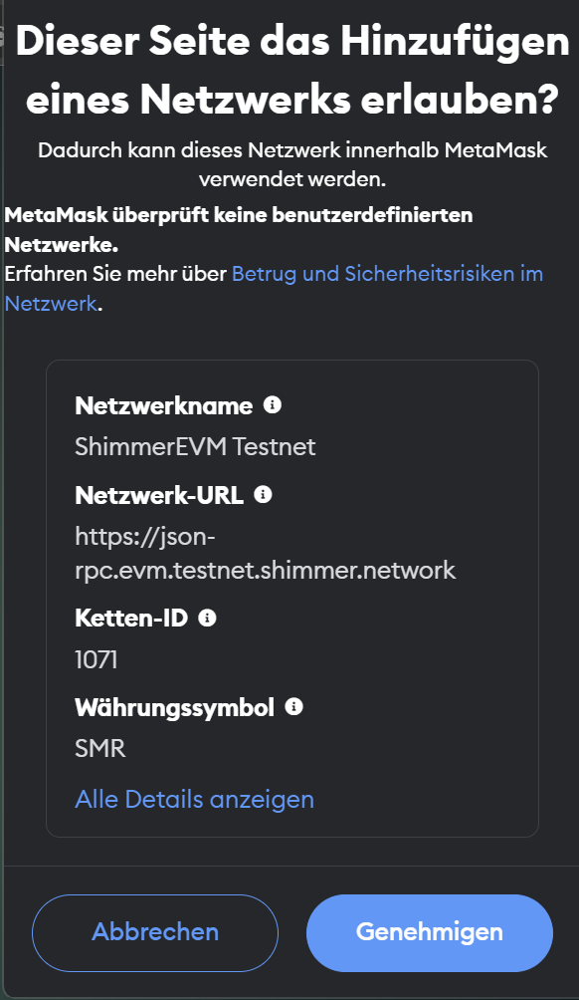
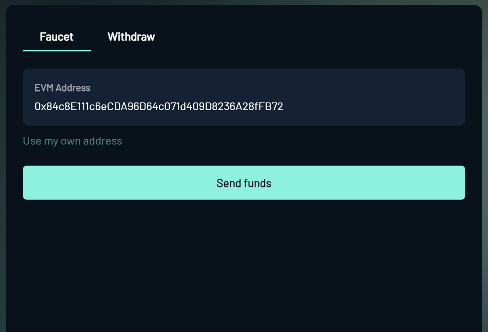

# tangleCon-awards

## tangleCon award soul bound token smart contract

This is the repository for the tangleCon SBT smart contract on the shimmer chain
[The Website](https://www.tanglecon.com/tanglecon-project-award/)

### Prereq

    ``` "Node.js v19.6.0" ```

### Setup 

- 1: Download [Metamask](https://metamask.io/download/)



- 2: Go through the wallet creation and export your private keys
```click on the 3 dots on your account -> accountdetails -> export private keys and copy the private key string```



- 3: Rename ```template.deployer.ts``` to ```deployer.ts``` in the tanglecon-awards and insert your private key into the specified field ``````



- 3: Connect your metamask with the [shimmer evm toolkit](https://evm-toolkit.evm.testnet.shimmer.network/) and add the shimmer testnet network to it



- 4: While you are at it, get some testnet shimmer through the faucet



### deployment 

- 1: In the root of tanglecon-awards run ```npm install``` to get all the dependecies

- 2: run ```npm run compile```

- 3: Modify the ```scripts/deploy.ts``` file to your liking (set baseuri for tokenid 1 and 2, first airdrop, etc.)

- 4: Run ```npm run deploy```

- 5: Copy the terminal outputs: ```Contractaddress``` and ```creation timestamp``` and use those to modify the ```verify``` command in ```package.json```

- 6: run ```npm verify``` wait a couple of seconds and your smart contract should be verified and ready to use through the [Blockexplorer](https://explorer.evm.testnet.shimmer.network/) web3 interface and metamask

